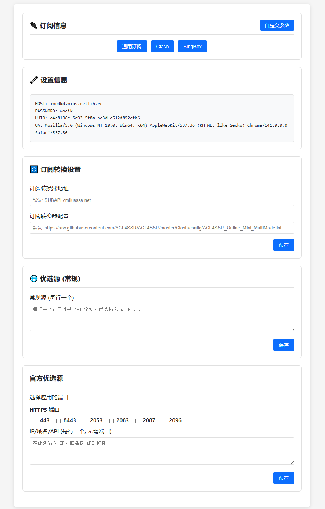

# 2.0版

## 2.0 使用说明
设置`PASSWORD`变量，变量值为您的密码，进入页面找到页面下方的`Admin Login`点击进入登录页面输入密码。

# 2.0 变量
| 常用变量 | 示例  |   备注    |
|--------|---------|-------|
| PASSWORD  | 123456 |   您的登录密码   |

这是在[cmliu edgetunnel](https://github.com/cmliu/edgetunnel)基础上进行修改，简化代码

# 变量
| 常用变量 | 示例 |
|--------|---------|
| UUID  | fca6e4ec-c882-4876-992c-cf354fd3f2ae |
| PROXYIP | bpb.radically.pro/1.2.3.4 |
| SOCKS5 | user:password@1.2.3.4 :2222 |
| HTTP | user:password@1.2.3.4 :2222 |
| ADD | icook.tw:8443#优选域名/1.2.3.4 :8443#优选IP |
| ADDAPI | https://raw.githubusercontent.com/yd072/youxuanyuming/refs/heads/main/ip.txt |
| ADDNOTLS | icook.tw:80#优选域名/1.2.3.4 :80#优选IP |
| ADDNOTLSAPI | https://raw.githubusercontent.com/yd072/youxuanyuming/refs/heads/main/ip.txt |
| SUB | sub.example.com |
| SUBAPI | subapi.example.com |
| ····· | ····· |

# 感谢
[cmliu](https://github.com/cmliu/edgetunnel)

